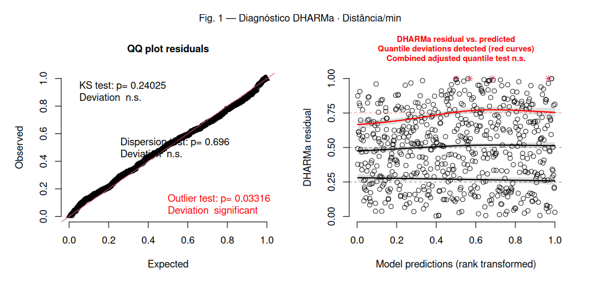
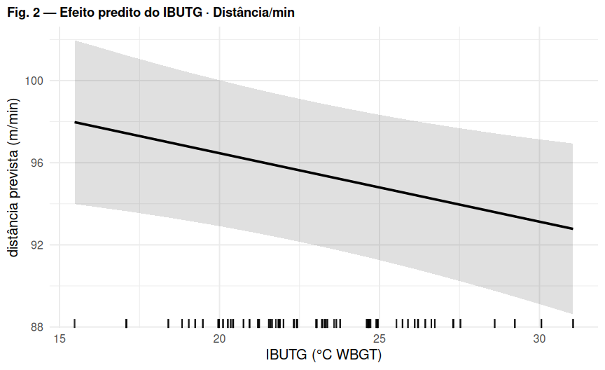

# Regressão 1 — Distância total por minuto (m/min)

*Comparação U17 vs U20 (referência: U20). Efeitos aleatórios: `(1 | atleta)`.*

## Modelo

``` r
distanciatotalminutos ~ IBUTG_med_c * categoria + posicao + (1 | atleta)
```

-   **Distribuição / link:** Gaussiana (identidade) — LMM

## Decisões importantes

-   Desfecho contínuo; a distância relativa (m/min) é aproximadamente normal no futebol.
-   LMM gaussiano passou no DHARMa (KS e dispersão ok; leve desvio nos quantis).
-   Gamma(log) foi testada e **não** melhorou de forma convincente — mantido gaussiano.
-   Efeito aleatório de jogo `(1 | numero_jg)` ainda **não** aplicado (decisão pendente).

## Coeficientes (efeitos fixos)

| Parameter             | Estimativa | SE    | IC 2.5% | IC 97.5% | p       |
|:----------------------|:-----------|:------|:--------|:---------|:--------|
| (Intercept)           | 95.422     | 1.774 | 91.939  | 98.905   | \<0.001 |
| IBUTG(c)              | -0.334     | 0.138 | -0.605  | -0.062   | 0.016   |
| categoriaU17          | 4.688      | 1.729 | 1.292   | 8.083    | 0.007   |
| posicaoATA            | 13.423     | 2.306 | 8.893   | 17.952   | \<0.001 |
| posicaoEXT            | 14.412     | 2.282 | 9.929   | 18.894   | \<0.001 |
| posicaoLAT            | 4.857      | 2.279 | 0.380   | 9.334    | 0.034   |
| posicaoMEI            | 16.160     | 2.449 | 11.351  | 20.969   | \<0.001 |
| posicaoVOL            | 16.359     | 2.474 | 11.500  | 21.218   | \<0.001 |
| IBUTG(c):categoriaU17 | -1.200     | 0.338 | -1.864  | -0.535   | \<0.001 |

*Estimativas na escala da resposta. IBUTG(c) = IBUTG centrado no valor médio.*

## Figura 1 — Diagnóstico de resíduos (DHARMa)



*Esquerda: QQ-plot dos resíduos escalonados (uniformidade). Direita: resíduos vs. valores previstos (curvas vermelhas = desvio de quantis).* *O teste de outliers na tabela abaixo usa o método **bootstrap** (mais confiável); pode divergir do rótulo do gráfico, que usa o teste binomial.*

## Figura 2 — Efeito predito do IBUTG



## Pressupostos (DHARMa)

| Teste                           | p-valor | Situação |
|:--------------------------------|:--------|:---------|
| Uniformidade / normalidade (KS) | 0.24    | ✅ ok    |
| Dispersão                       | 0.696   | ✅ ok    |
| Outliers (bootstrap)            | 0.18    | ✅ ok    |
| Quantis / homocedasticidade     | 0.0105  | ❌ viola |

## Ajuste do modelo

| Métrica       | Valor                     |
|:--------------|:--------------------------|
| N observações | 598                       |
| N atletas     | 53                        |
| AIC           | 4416.3                    |
| BIC           | 4464.6                    |
| logLik        | -2197.1                   |
| ICC (atleta)  | 0.183                     |
| R² (Nakagawa) | cond. 0.446 / marg. 0.322 |

## Conclusão
