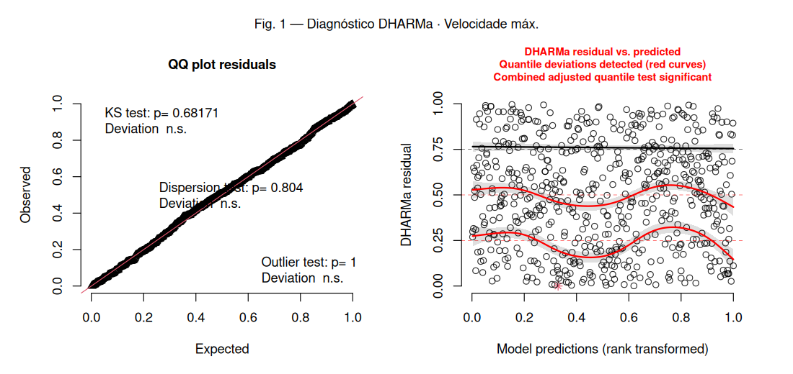
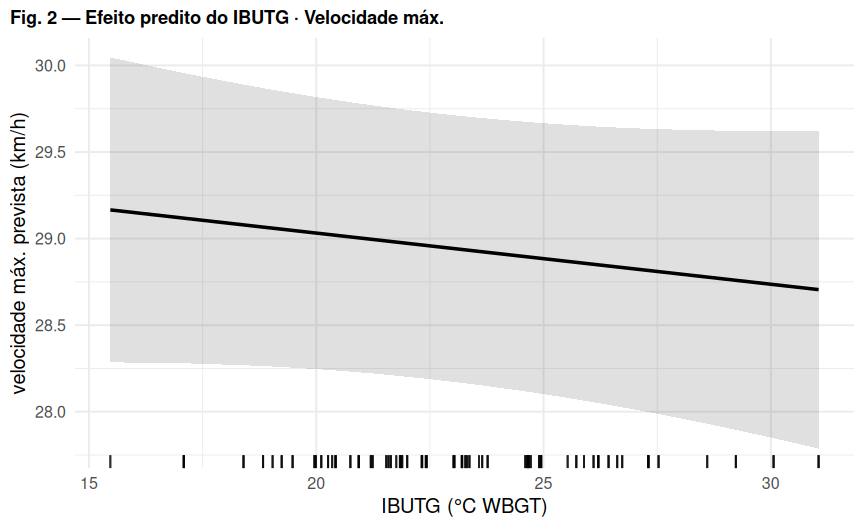
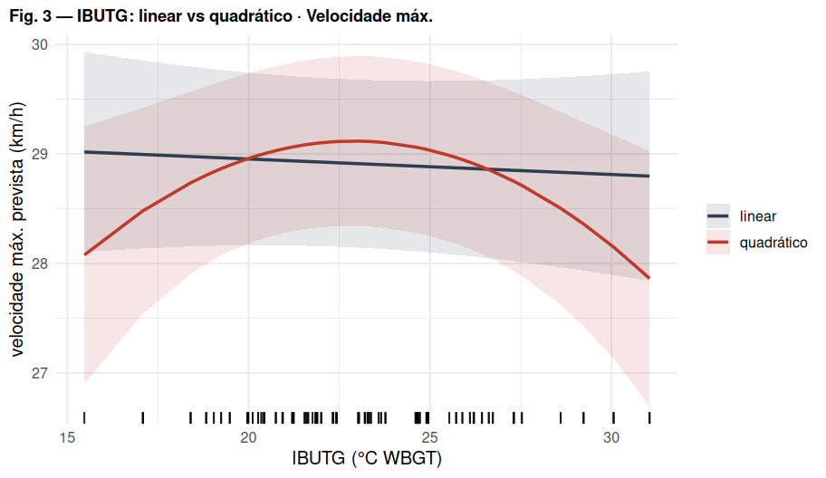

# Regressão 2 — Velocidade máxima (km/h)

*Comparação U17 vs U20 (referência: U20). Efeitos aleatórios: `(1 | atleta)`.*

## Modelo

``` r
velocidade_max_kmh ~ IBUTG_med_c * categoria + posicao + (1 | atleta)
# filtro: velocidade_max_kmh <= 40 (remove 3 erros de medida)
```

-   **Distribuição / link:** Gaussiana (identidade) — LMM

## Decisões importantes

-   **Limpeza de dados:** removidos 3 registros fisicamente impossíveis (77,8 / 84,2 / 94,5 km/h). O 4º maior valor real é \~35 km/h.
-   Após a limpeza o LMM gaussiano fica adequado (KS 0,91; dispersão ok).
-   É uma variável de **máximo por jogo** (bloco-máximo); Gaussiana serve na prática com os dados limpos.
-   **Não-linearidade do IBUTG:** com `(1|atleta)+(1|numero_jg)`, o termo quadrático é significativo (LRT p = 0.010) — curvatura real.

## Coeficientes (efeitos fixos)

| Parameter             | Estimativa | SE    | IC 2.5% | IC 97.5% | p       |
|:----------------------|:-----------|:------|:--------|:---------|:--------|
| (Intercept)           | 28.940     | 0.392 | 28.169  | 29.710   | \<0.001 |
| IBUTG(c)              | -0.030     | 0.030 | -0.089  | 0.030    | 0.330   |
| categoriaU17          | -0.600     | 0.384 | -1.353  | 0.154    | 0.119   |
| posicaoATA            | 1.130      | 0.509 | 0.130   | 2.131    | 0.027   |
| posicaoEXT            | 0.529      | 0.504 | -0.461  | 1.518    | 0.294   |
| posicaoLAT            | 0.608      | 0.506 | -0.386  | 1.601    | 0.230   |
| posicaoMEI            | -0.428     | 0.542 | -1.493  | 0.637    | 0.430   |
| posicaoVOL            | -0.044     | 0.546 | -1.116  | 1.028    | 0.936   |
| IBUTG(c):categoriaU17 | -0.146     | 0.076 | -0.295  | 0.003    | 0.056   |

*Estimativas na escala da resposta. IBUTG(c) = IBUTG centrado no valor médio.*

## Figura 1 — Diagnóstico de resíduos (DHARMa)



*Esquerda: QQ-plot dos resíduos escalonados (uniformidade). Direita: resíduos vs. valores previstos (curvas vermelhas = desvio de quantis).* *O teste de outliers na tabela abaixo usa o método **bootstrap** (mais confiável); pode divergir do rótulo do gráfico, que usa o teste binomial.*

## Figura 2 — Efeito predito do IBUTG



## Figura 3 — Forma do efeito do IBUTG: linear vs quadrático



LRT linear vs quadrático: χ² = 9.20, gl = 2, **p = 0.010**. A curva sobe até \~23 °C e cai acima de \~25 °C.

## Pressupostos (DHARMa)

| Teste                           | p-valor | Situação |
|:--------------------------------|:--------|:---------|
| Uniformidade / normalidade (KS) | 0.682   | ✅ ok    |
| Dispersão                       | 0.804   | ✅ ok    |
| Outliers (bootstrap)            | 0.84    | ✅ ok    |
| Quantis / homocedasticidade     | 0.0137  | ❌ viola |

## Ajuste do modelo

| Métrica       | Valor                     |
|:--------------|:--------------------------|
| N observações | 595                       |
| N atletas     | 53                        |
| AIC           | 2616.5                    |
| BIC           | 2664.8                    |
| logLik        | -1297.2                   |
| ICC (atleta)  | 0.186                     |
| R² (Nakagawa) | cond. 0.240 / marg. 0.066 |

## Conclusão
