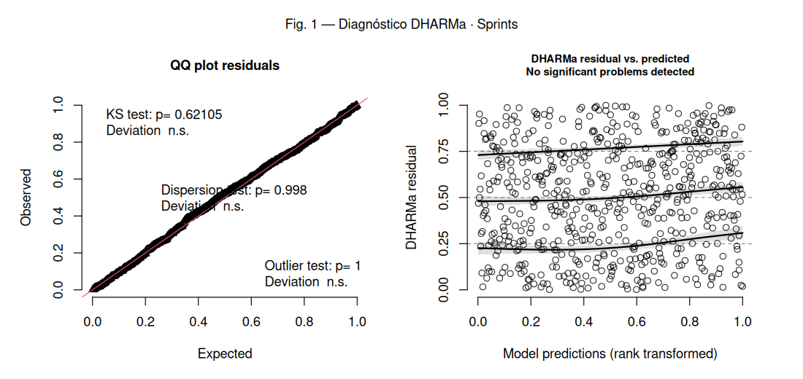
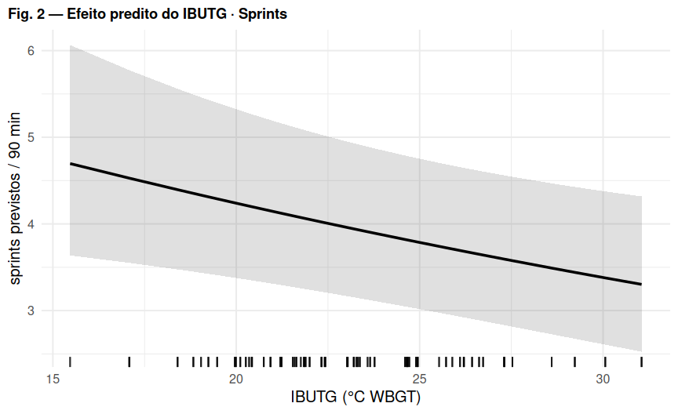
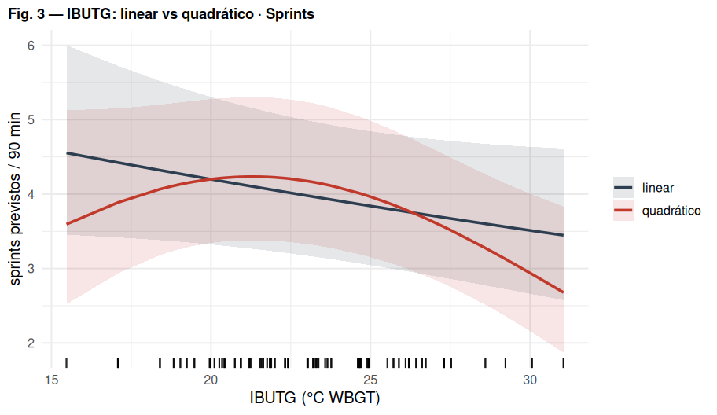

# Regressão 3 — Número de sprints (> 25 km/h)

_Comparação U17 vs U20 (referência: U20). Efeitos aleatórios: `(1 | atleta)`._

## Modelo

```r
sprint_25_kmh ~ IBUTG_med_c * categoria + posicao + offset(log(duracao_total_min)) + (1 | atleta)
```

- **Distribuição / link:** Binomial negativa (nbinom2, link log) — GLMM de contagem

## Decisões importantes

- `sprint_25_kmh` é **contagem** (0–16). Modelada como contagem, **não** como taxa `sprint/min` gaussiana.
- `offset(log(duração))` transforma o modelo na taxa de sprints por minuto respeitando a exposição variável (9–57 min).
- Sobredispersão leve (var/média ≈ 2) → binomial negativa; Poisson também passa, NB2 tem AIC um pouco menor.
- **Zero-inflação não é necessária** (ZIP não melhora o AIC).
- **Não-linearidade do IBUTG:** forma quadrática **não** se justifica (LRT p = 0.11) — manter linear.

## Coeficientes (efeitos fixos)

|Parameter             |Estim. (exp) |SE    |IC 2.5% |IC 97.5% |p      |
|:---------------------|:------------|:-----|:-------|:--------|:------|
|(Intercept)           |0.044        |0.005 |0.035   |0.055    |<0.001 |
|IBUTG(c)              |0.978        |0.009 |0.961   |0.995    |0.011  |
|categoriaU17          |0.909        |0.097 |0.738   |1.120    |0.370  |
|posicaoATA            |2.291        |0.329 |1.729   |3.036    |<0.001 |
|posicaoEXT            |2.400        |0.348 |1.807   |3.188    |<0.001 |
|posicaoLAT            |2.061        |0.295 |1.557   |2.730    |<0.001 |
|posicaoMEI            |1.399        |0.222 |1.025   |1.909    |0.034  |
|posicaoVOL            |1.535        |0.244 |1.124   |2.097    |0.007  |
|IBUTG(c):categoriaU17 |0.944        |0.022 |0.902   |0.987    |0.012  |

_Estimativas **exponenciadas** (razão): valor > 1 aumenta a resposta, < 1 diminui, por unidade do preditor. IBUTG(c) = IBUTG centrado na média._

## Figura 1 — Diagnóstico de resíduos (DHARMa)



_Esquerda: QQ-plot dos resíduos escalonados (uniformidade). Direita: resíduos vs. valores previstos (curvas vermelhas = desvio de quantis)._
_O teste de outliers na tabela abaixo usa o método **bootstrap** (mais confiável); pode divergir do rótulo do gráfico, que usa o teste binomial._

## Figura 2 — Efeito predito do IBUTG



## Figura 3 — Forma do efeito do IBUTG: linear vs quadrático



LRT linear vs quadrático: χ² = 4.44, gl = 2, p = 0.11 (n.s.). O spline (GAM) via um platô-e-queda que a parábola não reproduz; a forma **linear** é suficiente.

## Pressupostos (DHARMa)

|Teste                           |p-valor |Situação |
|:-------------------------------|:-------|:--------|
|Uniformidade / normalidade (KS) |0.621   |✅ ok    |
|Dispersão                       |0.998   |✅ ok    |
|Outliers (bootstrap)            |0.98    |✅ ok    |
|Quantis / homocedasticidade     |0.175   |✅ ok    |

## Ajuste do modelo

|Métrica       |Valor                     |
|:-------------|:-------------------------|
|N observações |598                       |
|N atletas     |53                        |
|AIC           |2413.4                    |
|BIC           |2461.7                    |
|logLik        |-1195.7                   |
|ICC (atleta)  |0.023                     |
|R² (Nakagawa) |cond. 0.069 / marg. 0.047 |

## Conclusão

GLMM binomial negativo com offset resolve os problemas de pressupostos da versão anterior (taxa gaussiana). O efeito do IBUTG é adequadamente **linear**. Recomenda-se reavaliar a significância do IBUTG após incluir `(1 | numero_jg)`.

