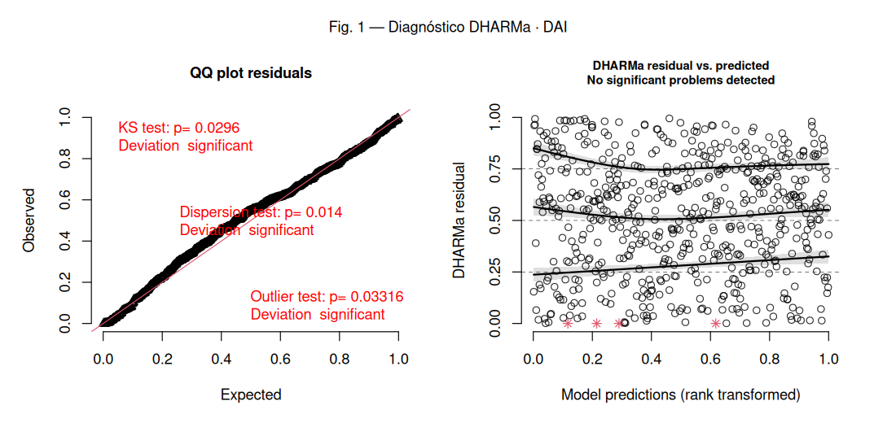
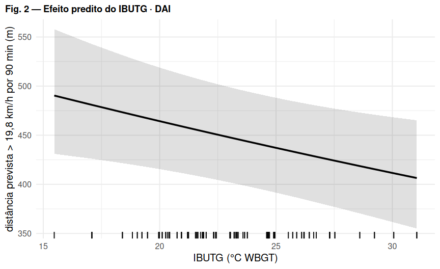

# Regressão 4 — DAI: distância em alta velocidade (\> 19,8 km/h)

*Comparação U17 vs U20 (referência: U20). Efeitos aleatórios: `(1 | atleta)`.*

## Modelo

``` r
soma_3_valoc19.8kmh ~ IBUTG_med_c * categoria + posicao + offset(log(duracao_total_min)) + (1 | atleta)
```

-   **Distribuição / link:** Gamma (link log) — GLMM contínuo positivo

## Decisões importantes

-   `soma_3_valoc19.8kmh` é **distância em metros** (contínua, positiva, assimétrica) — **não** é contagem.
-   Gamma(log) + `offset(log(duração))` modela a distância por minuto; melhora muito a forma dos quantis vs a taxa gaussiana.
-   Lognormal foi testada e ficou pior.
-   **Ressalva:** o teste de dispersão do DHARMa ainda acusa desvio (p ≈ 0,01) — vale testar **Tweedie**.

## Coeficientes (efeitos fixos)

| Parameter             | Estim. (exp) | SE    | IC 2.5% | IC 97.5% | p       |
|:----------------------|:-------------|:------|:--------|:---------|:--------|
| (Intercept)           | 4.969        | 0.274 | 4.460   | 5.535    | \<0.001 |
| IBUTG(c)              | 0.988        | 0.005 | 0.978   | 0.998    | 0.015   |
| categoriaU17          | 0.922        | 0.050 | 0.828   | 1.026    | 0.136   |
| posicaoATA            | 1.789        | 0.132 | 1.548   | 2.067    | \<0.001 |
| posicaoEXT            | 1.870        | 0.137 | 1.619   | 2.160    | \<0.001 |
| posicaoLAT            | 1.640        | 0.117 | 1.427   | 1.885    | \<0.001 |
| posicaoMEI            | 1.434        | 0.109 | 1.235   | 1.665    | \<0.001 |
| posicaoVOL            | 1.376        | 0.109 | 1.179   | 1.607    | \<0.001 |
| IBUTG(c):categoriaU17 | 0.977        | 0.012 | 0.954   | 1.000    | 0.052   |

*Estimativas **exponenciadas** (razão): valor \> 1 aumenta a resposta, \< 1 diminui, por unidade do preditor. IBUTG(c) = IBUTG centrado na média.*

## Figura 1 — Diagnóstico de resíduos (DHARMa)



*Esquerda: QQ-plot dos resíduos escalonados (uniformidade). Direita: resíduos vs. valores previstos (curvas vermelhas = desvio de quantis).* *O teste de outliers na tabela abaixo usa o método **bootstrap** (mais confiável); pode divergir do rótulo do gráfico, que usa o teste binomial.*

## Figura 2 — Efeito predito do IBUTG



## Pressupostos (DHARMa)

| Teste                           | p-valor | Situação |
|:--------------------------------|:--------|:---------|
| Uniformidade / normalidade (KS) | 0.0296  | ❌ viola |
| Dispersão                       | 0.014   | ❌ viola |
| Outliers (bootstrap)            | 0.26    | ✅ ok    |
| Quantis / homocedasticidade     | 0.117   | ✅ ok    |

## Ajuste do modelo

| Métrica       | Valor                     |
|:--------------|:--------------------------|
| N observações | 598                       |
| N atletas     | 53                        |
| AIC           | 7191.8                    |
| BIC           | 7240.2                    |
| logLik        | -3584.9                   |
| ICC (atleta)  | 0.123                     |
| R² (Nakagawa) | cond. 0.417 / marg. 0.334 |

## Conclusão
