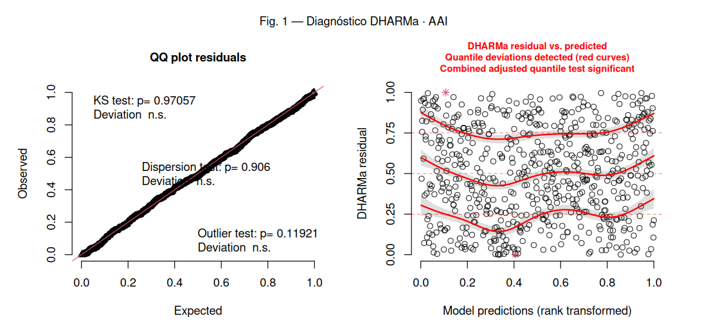
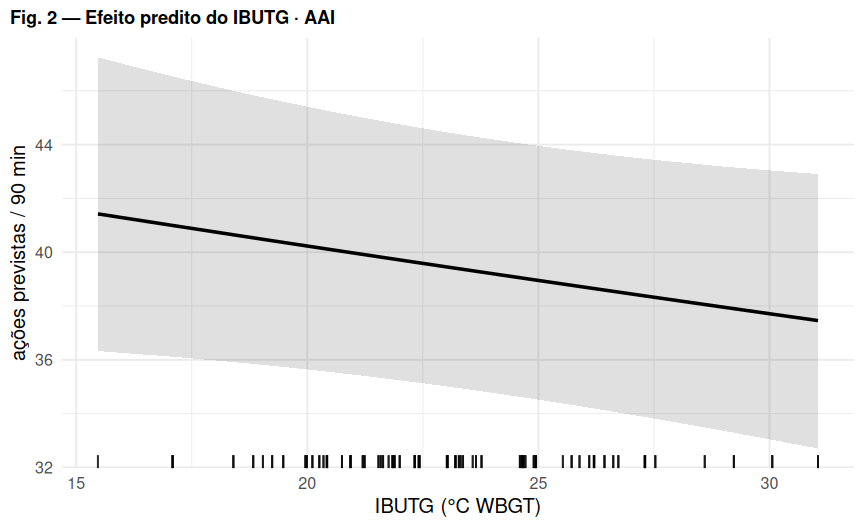

# Regressão 5 — AAI: ações de aceleração + desaceleração (> 3 m/s²)

_Comparação U17 vs U20 (referência: U20). Efeitos aleatórios: `(1 | atleta)`._

## Modelo

```r
AAI ~ IBUTG_med_c * categoria + posicao + offset(log(duracao_total_min)) + (1 | atleta)
# AAI = aceleracao_3_ms + desaceleracao_3_ms  (contagem)
```

- **Distribuição / link:** Binomial negativa (nbinom2, link log) — GLMM de contagem

## Decisões importantes

- `AAI` é a **soma de duas contagens** (acel + desacel), inteira e sobredispersa (Poisson AIC ~120 pontos pior que NB).
- Modelada como **contagem** com `offset(log(duração))` — não como taxa `AAI/min` gaussiana (que dava quantis = 0 no DHARMa).
- A interação `IBUTG × posição` foi **removida** (gerava VIF ≈ 5) — estrutura agora igual à dos outros modelos.
- Com o modelo correto, o DHARMa passa em tudo (KS 0,97; dispersão 0,91; quantis ~0,06).

## Coeficientes (efeitos fixos)

|Parameter             |Estim. (exp) |SE    |IC 2.5% |IC 97.5% |p      |
|:---------------------|:------------|:-----|:-------|:--------|:------|
|(Intercept)           |0.438        |0.027 |0.389   |0.494    |<0.001 |
|IBUTG(c)              |0.994        |0.004 |0.986   |1.001    |0.098  |
|categoriaU17          |0.993        |0.058 |0.886   |1.113    |0.904  |
|posicaoATA            |1.775        |0.134 |1.531   |2.058    |<0.001 |
|posicaoEXT            |1.852        |0.142 |1.593   |2.153    |<0.001 |
|posicaoLAT            |1.569        |0.115 |1.359   |1.812    |<0.001 |
|posicaoMEI            |1.464        |0.118 |1.250   |1.714    |<0.001 |
|posicaoVOL            |1.317        |0.107 |1.123   |1.544    |<0.001 |
|IBUTG(c):categoriaU17 |0.987        |0.010 |0.968   |1.006    |0.173  |

_Estimativas **exponenciadas** (razão): valor > 1 aumenta a resposta, < 1 diminui, por unidade do preditor. IBUTG(c) = IBUTG centrado na média._

## Figura 1 — Diagnóstico de resíduos (DHARMa)



_Esquerda: QQ-plot dos resíduos escalonados (uniformidade). Direita: resíduos vs. valores previstos (curvas vermelhas = desvio de quantis)._
_O teste de outliers na tabela abaixo usa o método **bootstrap** (mais confiável); pode divergir do rótulo do gráfico, que usa o teste binomial._

## Figura 2 — Efeito predito do IBUTG



## Pressupostos (DHARMa)

|Teste                           |p-valor |Situação |
|:-------------------------------|:-------|:--------|
|Uniformidade / normalidade (KS) |0.971   |✅ ok    |
|Dispersão                       |0.906   |✅ ok    |
|Outliers (bootstrap)            |0.9     |✅ ok    |
|Quantis / homocedasticidade     |0.059   |✅ ok    |

## Ajuste do modelo

|Métrica       |Valor                     |
|:-------------|:-------------------------|
|N observações |598                       |
|N atletas     |53                        |
|AIC           |4104.6                    |
|BIC           |4152.9                    |
|logLik        |-2041.3                   |
|ICC (atleta)  |0.028                     |
|R² (Nakagawa) |cond. 0.077 / marg. 0.050 |

## Conclusão

O GLMM binomial negativo com offset é o modelo adequado para o AAI e elimina as violações de pressuposto. Nele, **nem IBUTG nem categoria** têm efeito relevante — apenas a posição. Reavaliar após incluir `(1 | numero_jg)`.

