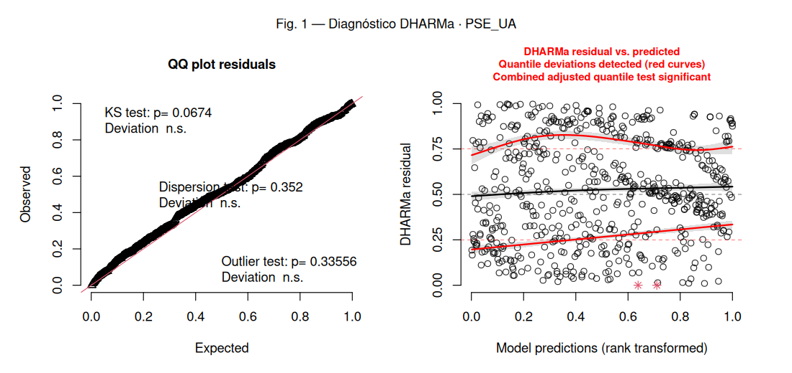
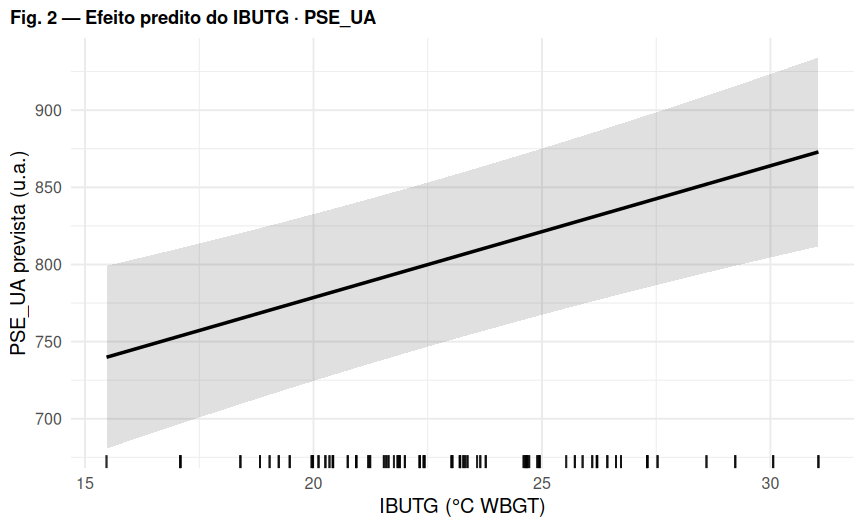

# Regressão 6 — PSE_UA: carga interna (PSE de Borg × duração)

_Comparação U17 vs U20 (referência: U20). Efeitos aleatórios: `(1 | atleta)`._

## Modelo

```r
PSE_UA ~ IBUTG_med_c * categoria + posicao + (1 | atleta)
```

- **Distribuição / link:** Gaussiana (identidade) — LMM

## Decisões importantes

- `PSE_UA` = PSE (escala de Borg CR10, concentrada em 7–10) × duração — composto ordinal × tempo.
- O LMM gaussiano teve o melhor diagnóstico do conjunto (KS e dispersão ok; desvio nos quantis).
- Gamma(log) foi testada e **piorou** — mantido gaussiano.
- Modelo formalmente ideal seria um *cumulative link mixed model* (`ordinal::clmm`) na PSE bruta com a duração como covariável.

## Coeficientes (efeitos fixos)

|Parameter             |Estimativa |SE     |IC 2.5%  |IC 97.5% |p      |
|:---------------------|:----------|:------|:--------|:--------|:------|
|(Intercept)           |805.226    |27.108 |751.986  |858.467  |<0.001 |
|IBUTG(c)              |8.540      |1.835  |4.936    |12.144   |<0.001 |
|categoriaU17          |44.289     |26.250 |-7.267   |95.844   |0.092  |
|posicaoATA            |-127.401   |34.322 |-194.810 |-59.992  |<0.001 |
|posicaoEXT            |-190.856   |34.228 |-258.081 |-123.631 |<0.001 |
|posicaoLAT            |-0.635     |33.964 |-67.341  |66.072   |0.985  |
|posicaoMEI            |-80.935    |36.593 |-152.804 |-9.066   |0.027  |
|posicaoVOL            |-77.233    |36.803 |-149.515 |-4.951   |0.036  |
|IBUTG(c):categoriaU17 |-11.994    |4.532  |-20.896  |-3.093   |0.008  |

_Estimativas na escala da resposta. IBUTG(c) = IBUTG centrado no valor médio._

## Figura 1 — Diagnóstico de resíduos (DHARMa)



_Esquerda: QQ-plot dos resíduos escalonados (uniformidade). Direita: resíduos vs. valores previstos (curvas vermelhas = desvio de quantis)._
_O teste de outliers na tabela abaixo usa o método **bootstrap** (mais confiável); pode divergir do rótulo do gráfico, que usa o teste binomial._

## Figura 2 — Efeito predito do IBUTG



## Pressupostos (DHARMa)

|Teste                           |p-valor |Situação |
|:-------------------------------|:-------|:--------|
|Uniformidade / normalidade (KS) |0.0674  |✅ ok    |
|Dispersão                       |0.352   |✅ ok    |
|Outliers (bootstrap)            |1       |✅ ok    |
|Quantis / homocedasticidade     |5.9e-05 |❌ viola |

## Ajuste do modelo

|Métrica       |Valor                     |
|:-------------|:-------------------------|
|N observações |598                       |
|N atletas     |53                        |
|AIC           |7473.2                    |
|BIC           |7521.5                    |
|logLik        |-3725.6                   |
|ICC (atleta)  |0.261                     |
|R² (Nakagawa) |cond. 0.429 / marg. 0.228 |

## Conclusão

Gaussiano é defensável e é a convenção para sRPE-load em ciência do esporte; o desvio nos quantis é a limitação remanescente. Para rigor máximo, migrar para CLMM ordinal na PSE. Reavaliar o efeito do IBUTG após incluir `(1 | numero_jg)`.

